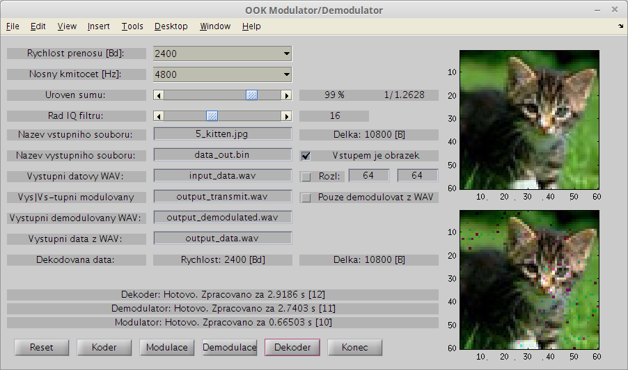

Matlab OOK modem
================

On Off Keying modulator/demodulator writen in Matlab r2012A, school project
Directories:
* data  - images for testing 
* tests - tested images
* unix - file with LF terminators
* windows - file with CRLF terminators

Image

Features:
* Select baud rate
* Select carrier frequency
* Add some noise
* Writing and reading from WAV files
* Reading images
* Only for small files < 12.2 kb
